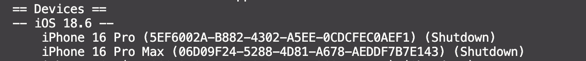

# pt-app
A cross-platform mobile application that aims to approximate key elements
of working with a human personal trainer by combining: (i) single-camera pose estimation
for supported exercises and real-time feedback; (ii) exercise and nutrition tracking; and (iii) a
conversational multimodal large language model (MLLM) coach.

## Prerequisites
Install the following (if you don't have them already):
- Flutter
- Node.js
- Android Studio (for android devices)
- Xcode + CocoaPods (for iOS users, macOS exclusive)

## Clone and Install Dependencies
run the following
```bash
git clone <repo_url>
cd <repo_folder>
flutter pub get
```
## Run the app

### Android
from the project root, 

`flutter run`

### iOS
#### Simulator

`xcrun simctl list`

You should then see something like: 
Pick the device you wish to simulate, and run something along the lines of

`xcrun simctl boot <UUID>`, where UUID is something like 5EF6002A-B882-4302-A5EE-0CDCFEC0AEF1.

followed by `open -a simulator`

With a simulator running, you can now run

`flutter run`

#### Physical iPhone
- in xcode, open ios/Runner.xcworkspace. 
- Go to Runner -> Signing & Capabilities -> select your Team
- From your project root, run `flutter run --release`
